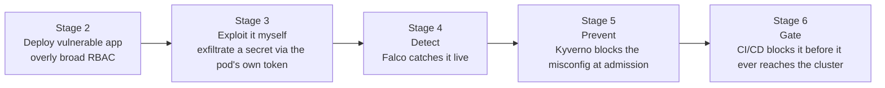
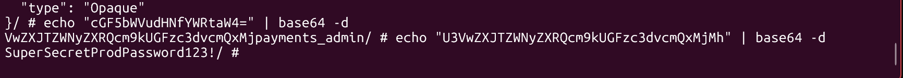
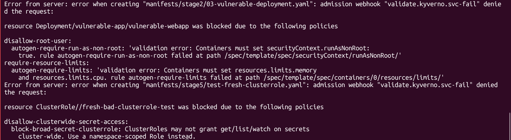
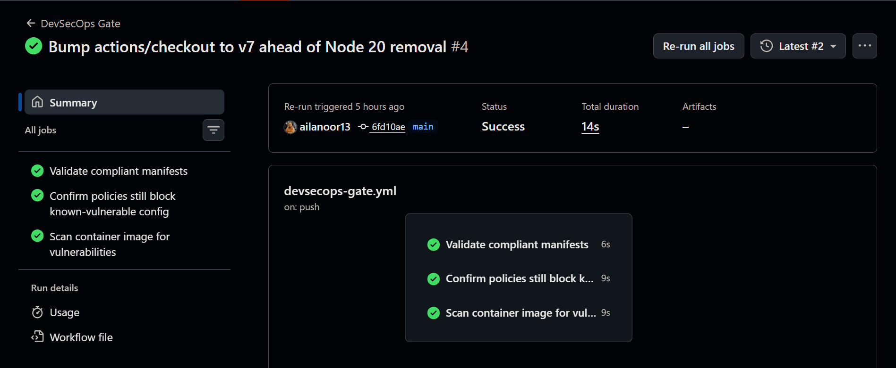

# Kubernetes Security Hardening Lab


I built a Kubernetes cluster, deployed an app onto it with a real security hole, broke into my own app to prove the hole was actually exploitable, then spent the rest of the project making sure it could never happen again, first by catching it in the act, then by making it un-deployable, then by making sure a pipeline would catch it even if I forgot all of the above.

Repo: https://github.com/ailanoor13/k8s-security-hardening-lab
License: MIT

## Table of Contents

- [What This Actually Is](#what-this-actually-is)
- [What This Project Demonstrates](#what-this-project-demonstrates)
- [Before vs After](#before-vs-after)
- [Pipeline Architecture](#pipeline-architecture)
- [Security Controls Implemented](#security-controls-implemented)
- [Major Failures, Fixes, and Lessons Learned](#major-failures-fixes-and-lessons-learned)
- [Validation Evidence](#validation-evidence)
- [How to Run This Locally](#how-to-run-this-locally)
- [How to Adapt This for an Organization](#how-to-adapt-this-for-an-organization)
- [Remaining Caveats and Accepted Risks](#remaining-caveats-and-accepted-risks)
- [Why I Built It This Way](#why-i-built-it-this-way)

## What This Actually Is

I am a second year computer engineering student, currently going through the AWS re/Start program, and this is my third security focused project after an S3 misconfiguration lab and a VPN project. I wanted something that actually used Kubernetes, since I had not touched it before this, and I wanted it to follow the same shape as my earlier work: do not just describe a vulnerability, actually exploit it, then actually fix it.

So that is what this is. A real 3 node cluster on AWS, a web app I deployed with a genuine RBAC misconfiguration, a real exploit I ran against my own cluster, a detection layer that caught me doing it, a policy engine that now refuses to let that misconfiguration exist at all, and a CI pipeline that checks all of this automatically every time I push code. Nine separate real failures happened while I was building this, from a rate limited GitHub API to a live supply chain incident in a dependency I was using, and I kept every single one in this README instead of quietly fixing them and pretending it was smooth the whole way.

It was not smooth. It was genuinely a lot of debugging. That is kind of the point.

## What This Project Demonstrates

- A real RBAC exploitation, not a slide describing what one looks like
- Runtime threat detection with Falco, catching the exploit as it happens, live
- Policy as code prevention with Kyverno, enforced at admission time, not just flagged afterward
- A CI/CD gate that checks a compliant config passes AND that a known bad config still fails, so a broken policy would get caught, not just a missing one
- Infrastructure as code with Terraform, a dedicated least privilege IAM user, and a security group locked to one IP
- A real engineering tradeoff made under actual resource constraints, switching from kubeadm to k3s because the numbers just did not work on the instance types I could afford
- Every failure documented as it happened, including a live third party supply chain incident I stumbled into mid project

## Before vs After

| Area | Before (Stage 2 baseline) | After (Stage 5/6 hardened) |
|---|---|---|
| RBAC | A ClusterRole grants `get`/`list`/`watch` on secrets across the entire cluster | A namespace scoped Role restricted to one named secret |
| Container privileges | No `securityContext`, container runs as root by default | `runAsNonRoot` required, explicit non-root `runAsUser` set |
| Resource limits | None set | CPU and memory limits and requests required by policy |
| Detection | None, the exploit runs and nothing notices | Falco alerts in real time on shell spawns and unexpected Kubernetes API calls |
| Prevention | None, misconfigured resources deploy freely | Kyverno ClusterPolicies block noncompliant resources at admission time |
| CI/CD | None, changes reach the cluster unchecked | A GitHub Actions gate validates manifests and scans the image before merge |
| Image scanning | None | Trivy scans for CRITICAL severity vulnerabilities, pipeline fails on findings |

## Pipeline Architecture

The cluster runs on 3 AWS EC2 instances (1 control plane, 2 workers), provisioned with Terraform, running k3s instead of raw kubeadm because I was working with 2GB RAM nodes and kubeadm's control plane alone wants close to that on its own. The security story moves through six stages:



Falco runs in a namespace I called `canary`, the early warning layer, named after the coal mine thing, something small and sensitive that tells you danger is coming before it actually gets you. Kyverno runs in a namespace called `bouncer`, because that is genuinely what it does, it stands at the door and decides what gets in.

## Security Controls Implemented

- Namespace scoped RBAC (Role and RoleBinding) in place of a cluster wide ClusterRole
- Kyverno policy denying containers that do not set `runAsNonRoot: true`
- Kyverno policy requiring CPU and memory resource limits on every container
- Kyverno policy denying any ClusterRole that grants cluster wide `get`/`list`/`watch` on secrets, the exact pattern I exploited in Stage 3
- Falco runtime detection for shell spawns inside containers and unexpected outbound connections to the Kubernetes API server
- A CI/CD policy gate that checks a compliant manifest passes and a known vulnerable manifest still gets rejected, on every push
- Container image vulnerability scanning with Trivy, gated on CRITICAL severity findings
- A security group locked to a single trusted IP for SSH, the Kubernetes API, and the NodePort range
- A dedicated least privilege IAM user for all infrastructure work, root credentials never touched after initial setup
- Infrastructure as code with Terraform, so the whole environment is reproducible from scratch
- Git hygiene, a widened `.gitignore` pattern and a manual double check to confirm no real secrets ever got committed

## Major Failures, Fixes, and Lessons Learned

I am including all of these on purpose. A portfolio project with zero visible mistakes usually means the mistakes just got edited out before anyone saw them, and I think the debugging is honestly more interesting than the parts that worked on the first try.

| Problem | Root cause | Remediation | Lesson learned |
|---|---|---|---|
| `t3.medium` rejected on instance creation | AWS account was only permitted specific free tier eligible instance types, `t3.medium` was not one of them | Switched from kubeadm to k3s, which needs far less memory for the control plane, and used `t3.small` instead | Check what your account actually allows before assuming a bigger instance is the fix |
| CloudWatch billing alarm description showed a literal `$$` instead of the dollar amount | Terraform string interpolation was escaped with a double dollar sign by mistake | Corrected to single dollar sign interpolation | Small IaC syntax slips can produce cosmetic bugs in monitoring that are easy to miss unless you actually look at the generated output |
| `kubectl` from my own machine failed with an x509 certificate error | The k3s default certificate only listed the private IP and localhost as valid, not the public IP | Added a `tls-san` entry to the k3s config and restarted k3s to regenerate the certificate | Know what a default cert actually covers before assuming remote access will just work |
| SSH and `kubectl` access broke more than once, connections would just hang with no error | My home ISP rotates my IP periodically, and the security group was locked to whatever the old one was | Recurring fix, grab the current IP, update `terraform.tfvars`, reapply, only the affected security group rules change | Locking access to a residential IP that changes on its own is a real tradeoff, not a one time fix, I hit this three separate times |
| Deployment hit permission errors partway through the build | Initial IAM policy set for my project user did not include SNS or CloudWatch permissions | Added the missing permissions once I actually needed them | Least privilege in practice is usually iterative, you rarely get the permission set exactly right on the first try |
| Could not delete the original misconfigured ClusterRole during testing | My Kyverno deny policy matched delete operations too, not just create like I intended | Created a fresh, differently named test resource with the same bad rule to get a clean blocked on creation proof instead | Admission policies can have side effects you did not plan for, always check what operations a rule actually matches, not just what you meant it to match |
| A warning appeared about the Kyverno reports controller lacking permission to scan ClusterRoles | Its service account was never granted `get`/`list`/`watch` on ClusterRoles | Left as a known limitation, it only affects background compliance reporting, real time admission blocking still works correctly and I verified that directly | Runtime enforcement and background reporting are separate systems with separate permissions, a gap in one does not mean a gap in the other |
| Found a stray `terraform.tfvars.save` backup file sitting in the repo right before my first commit | My original `.gitignore` only excluded the exact filename `terraform.tfvars`, not backup variants | Deleted the file (it only had placeholder values, nothing real), widened the pattern to `terraform.tfvars.*` with an exception for the example template | An exact filename match in gitignore will not catch editor backup files, check for variants, not just the original name |
| First `git push` got rejected over divergent histories | GitHub auto created a LICENSE commit when I made the repo, which conflicted with my separately initialized local history | Merged with `--allow-unrelated-histories` before the first push | Initializing a repo locally before the remote exists sets you up for an avoidable conflict on your very first push |
| `image-scan` job failed, could not resolve `aquasecurity/trivy-action@0.28.0` | The action had migrated to differently formatted version tags following an actual supply chain attack, where most of its existing tags had been force pushed with malicious commits | Repinned to the current clean release, `v0.36.0` | Even a version you already pinned can stop being safe if the tagging scheme itself gets compromised, this has nothing to do with your own code and everything to do with staying aware of your dependencies |
| CI logs showed deprecation warnings for Node.js 20 on `actions/checkout@v4`, with GitHub actually planning to remove it from hosted runners | GitHub is retiring the Node 20 runtime that older action versions depend on | Bumped every `actions/checkout` reference to `v7` | A warning that looks low priority can have a real deadline behind it, worth actually reading what it is counting down to |
| Kyverno CLI install step failed, `tar` errored with "not in gzip format" | The workflow looked up the latest Kyverno release through an unauthenticated call to the GitHub REST API, which is capped at 60 requests per hour per IP, and GitHub hosted runners share IP pools across a massive number of concurrent jobs worldwide, so the call was already rate limited before my job even ran, leaving the version variable empty and the download URL broken | Swapped the hand rolled curl and tar script for the official `kyverno/action-install-cli` action, pinned to a specific release instead of resolving "latest" at runtime | Calling `api.github.com` without authentication from inside a GitHub Actions job is more fragile than it looks, and an official installer action pinned to a real version beats a script guessing at "latest" every single time |

## Validation Evidence

**Stage 3, exploitation.** Here is the actual command I ran from inside the vulnerable pod, followed by what came back once I decoded it.

```
$ kubectl exec -it -n vulnerable-app deploy/vulnerable-webapp -- sh
/ # curl -s --cacert /var/run/secrets/kubernetes.io/serviceaccount/ca.crt \
  -H "Authorization: Bearer [REDACTED]" \
  https://kubernetes.default.svc/api/v1/namespaces/victim-app/secrets/payments-db-credentials
```



That screenshot shows the base64 decode landing on `payments_admin` and the real password, pulled from a namespace this app had zero legitimate reason to touch. A workload with no reason to read secrets at all just read another team's database credentials, purely because of how the RBAC was scoped.

**Stage 4, detection.** This is a cleaned up version of the real Falco output, same data, timestamps and all, with the noisy connection metadata trimmed and the bearer token removed rather than blacked out, since a token split across multiple lines is exactly the kind of thing that is easy to redact badly.

```
18:01:42.131252102: Notice A shell was spawned in a container with an attached terminal
  process=sh  user=root  container=webapp  image=nginx:alpine
  k8s_namespace=vulnerable-app  pod=vulnerable-webapp-8d7cf68f-x6z8v

18:01:57.556008568: Notice Unexpected connection to K8s API Server from container
  process=curl  user=root  container=webapp
  command=curl -s --cacert /var/run/secrets/kubernetes.io/serviceaccount/ca.crt \
    -H "Authorization: Bearer [REDACTED]" \
    https://kubernetes.default.svc/api/v1/namespaces/victim-app/secrets/payments-db-credentials
  k8s_namespace=vulnerable-app  pod=vulnerable-webapp-8d7cf68f-x6z8v
```

Falco caught the shell spawn the second I exec'd in, and flagged the outbound API call a few seconds later. It did not stop anything, that is not its job, but it means this would not have happened silently.

**Stage 5, prevention.** Terminal output of `kubectl apply` cleanly rejecting both the original vulnerable Deployment and a freshly created ClusterRole with the same bad rule structure, citing the exact policies it violated.



**Stage 6, CI/CD gate.** All three jobs passing together on the same commit, `policy-gate`, `policy-regression-test`, and `image-scan`.




## How to Run This Locally

1. Clone the repo, copy `terraform/terraform.tfvars.example` to `terraform/terraform.tfvars`, fill in your own values including your current IP from `curl -s https://checkip.amazonaws.com`.
2. Run `terraform init` and `terraform apply` inside `terraform/` to provision the VPC, security group, and three EC2 instances.
3. SSH into the control plane, start k3s, grab the node token, manually join both workers.
4. Copy the k3s kubeconfig locally and point `kubectl` at the control plane's public IP.
5. Apply the Stage 2 manifests in `manifests/stage2/` to deploy the intentionally vulnerable app.
6. Install Falco and Kyverno via Helm into the `canary` and `bouncer` namespaces.
7. Apply the Stage 5 policies in `manifests/stage5/`.
8. Push to `main` to trigger the CI/CD gate in `.github/workflows/devsecops-gate.yml`.

If your home IP changes and access breaks, this happened to me three times, update `my_ip` in `terraform.tfvars` and reapply. Only the affected security group rules get replaced.

## How to Adapt This for an Organization

- The Kyverno policies in `manifests/stage5/` are a small starting policy library, not a finished one. A team could grow this into a shared, versioned policy bundle applied consistently across every cluster through GitOps, instead of applied by hand per environment like I did here.
- The CI/CD gate pattern, check a known good config passes and a known bad config still fails, is worth keeping no matter which policy engine or scanner you use. It catches a silently broken policy, not just a missing one, which is exactly what almost happened to me with the ClusterRole delete quirk above.
- Falco's default ruleset is a fine starting point, but a real deployment would tune it to the organization's actual workloads to cut noise and cover gaps specific to their environment.
- The exploit, detect, prevent, gate structure is reusable past RBAC specifically. The same shape works for network policies, pod security standards, or image provenance, whatever misconfiguration class you are trying to close off.

## Remaining Caveats and Accepted Risks

- The original misconfigured ClusterRole from Stage 2 is still sitting in the cluster. The same policy that blocks recreating it also blocks deleting it, so it is a known, contained leftover rather than something silently swept away.
- The Kyverno background reports controller cannot currently scan pre-existing ClusterRoles for compliance reporting, due to a missing permission. Real time admission blocking is unaffected by this.
- The cluster's security group is locked to a single IP tied to a residential connection that rotates on its own. Fine for a personal lab, not a pattern I would suggest for multi user or production access as is.
- The nodes are `t3.small`, chosen for cost and free tier eligibility, not sized to represent a production scale cluster.
- Falco is running its default ruleset rather than a custom tuned one, appropriate for demonstrating detection capability, would need real tuning for an actual workload.

## Why I Built It This Way

Writing a misconfigured manifest is easy, plenty of tutorials show you exactly how. What I actually wanted out of this project was proof that I understand the whole lifecycle around one, not just the manifest itself. So I exploited it myself instead of describing what an exploit would look like, built both detection and prevention instead of picking whichever was easier, and then added a pipeline so the fix does not depend on me remembering to reapply a policy by hand every time.

I also treated the tooling itself with the same suspicion I was applying to my own cluster. The Trivy supply chain incident was not something I went looking for, it just broke my pipeline one day, and figuring out why led me to an actual security incident in a dependency I trusted without thinking about it. Same with the Kyverno rate limiting failure, I did not guess at the fix, I reproduced the exact same failure from a separate environment before touching anything. That is most of what this project actually is, not the parts that worked cleanly, but what happened when they did not, and what I did about it.
